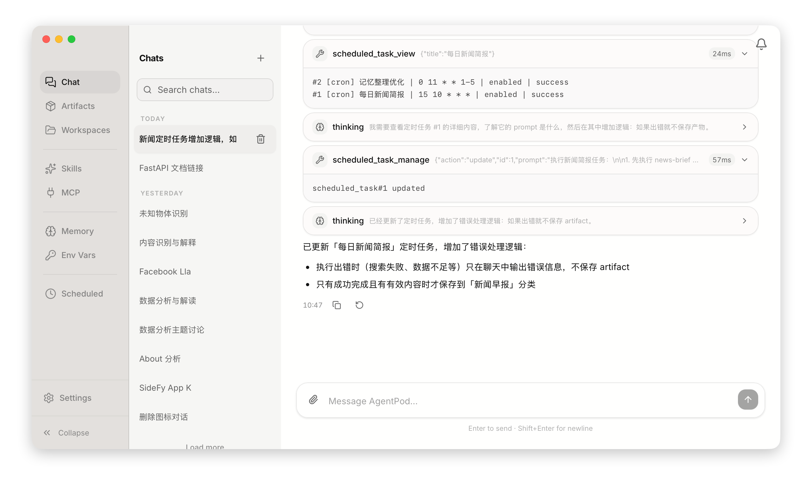

# AgentPod

[](https://github.com/sha2kyou/agentpod/actions/workflows/ci.yml)
[](https://github.com/sha2kyou/agentpod/releases)
[](LICENSE)

**AgentPod** is a local-first desktop AI agent for macOS and Windows. Chat with an LLM that can read and write files in your workspace, run code, search the web, connect MCP servers, remember context across sessions, and automate recurring work — all with data stored on your machine.

Configuration and runtime data live under `~/.agentpod/` (macOS/Linux) or `%USERPROFILE%\.agentpod\` (Windows): `settings.json`, SQLite databases, and per-workspace storage.



## About the name

**Agent** + **Pod**: an AI agent in its own isolated runtime.

The project began as a self-hosted platform: a **Host** control plane orchestrated **one Docker container per user**. Each container was the *pod*—where that user's chat loop, tools, SQLite data, and MCP connections ran, isolated from everyone else.

Later the product became a **local desktop app** (macOS and Windows). Host and Agent now ship as a bundled sidecar monolith; on a single machine, **multi-workspace** isolation on disk replaced per-user containers. The name stayed: *Pod* still means a dedicated, isolated place for an agent to run.

## Highlights

- **Local & private** — Conversations, memory, and workspace files stay on your machine. No cloud account required beyond your LLM provider API key.
- **Tool-native agent loop** — File I/O, sandboxed code execution, controlled terminal commands, web search/extract, and file delivery from a single chat UI.
- **Skills** — Reusable instruction packs (built-in, shared, and user-defined) loaded on demand for specialized workflows.
- **MCP** — Plug in Model Context Protocol servers for calendars, databases, APIs, and other external systems.
- **Memory** — Long-term facts/preferences and short-term notes that persist across sessions, scoped per workspace.
- **Artifacts** — Save deliverables into categorized libraries and recall them later.
- **Scheduled tasks** — Cron-style prompts that run automatically in the background.
- **Multi-workspace** — Separate files, sessions, memory, and settings for different projects or clients.
- **Resilient streaming** — Agent runs continue locally in the background if you navigate away or refresh; the UI reconnects to in-progress runs.

## Install

### macOS (Apple Silicon)

**arm64 only** — via Homebrew:

```bash
brew tap sha2kyou/tap
brew trust --cask sha2kyou/tap/agentpod
brew install --cask agentpod
```

Intel Macs are not supported in current release builds.

### Windows (x64)

Download the latest installer from [GitHub Releases](https://github.com/sha2kyou/agentpod/releases):

`AgentPod_<version>_windows-x64.exe`

Run the installer and launch **AgentPod** from the Start menu or desktop shortcut. **x64 (64-bit) only** — ARM64 Windows is not supported in current release builds.

### First launch

1. Open **Settings → Models** and add your LLM provider API key and primary model.
2. Optionally configure web search/extract keys and enable tools under **Settings → Tools**.
3. Start chatting. Attach files, queue follow-up messages while the agent is generating, or switch workspaces from the sidebar.

## Project layout

```
agentpod/
├── frontend/          React + Vite SPA (chat UI, settings, routes)
├── desktop/           Tauri 2 shell (macOS .app / .dmg, Windows NSIS installer)
├── sidecar/           Bundled Python entrypoint (Host + Agent monolith)
├── host/              Settings, API proxies, workspace metadata
├── agent/             Chat loop, tools, memory, MCP, persistence
├── shared/            Shared settings & utilities
├── shared-skills/     Built-in Skills shipped with the app
├── tests/             Python integration tests
└── scripts/           Version sync, bundle helpers
```

The sidecar listens on **`127.0.0.1:21223`** and serves both the UI and API from the same origin. In production the desktop app embeds a standalone Python 3.11 runtime; in development you usually run `agentpod-serve` yourself (see below).

## Build from source

Shared requirements: [uv](https://docs.astral.sh/uv/), Node.js 22+, Rust (stable). Production bundles embed a standalone Python 3.11 runtime via uv.

### macOS (Apple Silicon)

**Requirements:** macOS (Apple Silicon), Python 3.11+ (for local dev; the bundle script uses uv-managed Python).

Full desktop build (bundled venv + frontend + Tauri release):

```bash
./rebuild.sh
open dist/AgentPod.app
```

Artifacts are copied to `dist/` (`AgentPod.app` and `AgentPod_<version>_macos-arm64.dmg`).

```bash
./rebuild.sh --fresh-venv              # force rebuild bundled Python (slow)
python3 scripts/sync-version.py        # sync VERSION → all manifests
```

### Windows (x64)

**Requirements:** Windows 10/11 x64, PowerShell, [uv](https://docs.astral.sh/uv/), Node.js 22+, Rust with the `x86_64-pc-windows-msvc` target (`rustup target add x86_64-pc-windows-msvc`).

Full desktop build (bundled venv + frontend + Tauri NSIS installer):

```powershell
pwsh ./scripts/build-desktop-windows.ps1
```

The installer is copied to `dist/AgentPod_<version>_windows-x64.exe`.

```powershell
pwsh ./scripts/build-desktop-windows.ps1 -FreshVenv   # force rebuild bundled Python (slow)
uv run python scripts/sync-version.py                 # sync VERSION → all manifests
```

## Development

### Sidecar (API + UI host)

From the repo root:

```bash
uv sync --group dev
uv run agentpod-serve
```

The process binds to `http://127.0.0.1:21223` and stores data under your user `.agentpod` directory (see [Configuration](#configuration)).

### Python tests

```bash
uv sync --group dev
uv run pytest tests/ -q
```

### Frontend (Vite HMR)

With the sidecar running in another terminal:

```bash
cd frontend
npm ci
npm run dev              # Vite dev server; proxies /api to :21223
npm run build:desktop    # production bundle for Tauri / sidecar static UI
npm run lint
npm run test:latex && npm run test:notifications && npm run test:toast && npm run test:stream-sync
```

### Desktop (Tauri shell)

Build the desktop bundle first (`npm run build:desktop` in `frontend/`), start `agentpod-serve`, then:

```bash
cd desktop
npm ci
npm run dev              # Tauri window → devUrl http://127.0.0.1:21223
```

## Configuration

| Location | Purpose |
|----------|---------|
| `<home>/.agentpod/settings.json` | Global settings (models, tool keys, host options) |
| `<home>/.agentpod/host.sqlite` | Host metadata (workspace registry, etc.) |
| `<home>/.agentpod/workspaces/<id>/agent.sqlite` | Sessions, messages, memory, runs for that workspace |
| `<home>/.agentpod/workspaces/<id>/workspace/` | Workspace files the agent can read and write |
| `<home>/.agentpod/skills/` | User Skills synced from the app |

`<home>` is `~` on macOS/Linux and `%USERPROFILE%` on Windows. Override with the `AGENTPOD_HOME` environment variable.

See `shared/settings.example.json` for an annotated example of host settings.

## Documentation

| Doc | Audience |
|-----|----------|
| [docs/AGENTPOD.md](./docs/AGENTPOD.md) | In-app AI agent — platform capabilities, tools, and user-facing conventions (Chinese) |
| [cliff.toml](./cliff.toml) + GitHub Releases | Changelog generated on tagged releases |

## License

Licensed under the [Apache License, Version 2.0](LICENSE).

Copyright © 2026 AgentPod Team

---

**Version:** [latest release](https://github.com/sha2kyou/agentpod/releases) · **Platforms:** macOS (arm64), Windows (x64)
