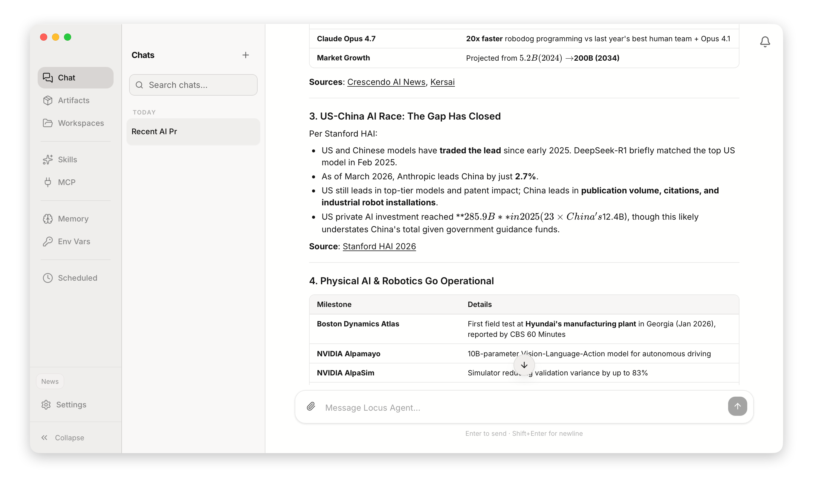
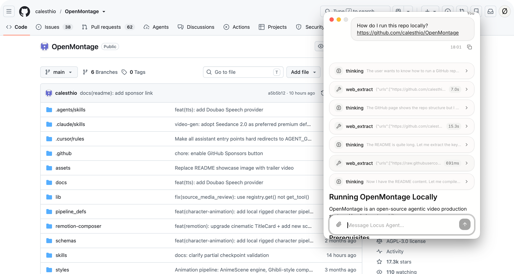

# Locus Agent

[](https://github.com/sha2kyou/locusagent/actions/workflows/ci.yml)
[](https://github.com/sha2kyou/locusagent/releases)
[](LICENSE)

[English](./README.md) · [简体中文](./README.zh-CN.md)

**Locus Agent** is a local-first desktop AI agent for macOS and Windows, built around **deliverables**—reports, scripts, workspace files, and categorized **Artifacts** you can recall and iterate on later. Chat is how you steer the work; the point is output you can keep.

Turn a brief into finished work: the agent reads and writes files in your workspace, runs code, searches the web, connects MCP servers, remembers context across sessions, and runs recurring prompts on a schedule. Everything stays on your machine.

Runtime data lives under `~/.locusagent/` (macOS/Linux) or `%USERPROFILE%\.locusagent\` (Windows): `settings.json`, SQLite databases, and per-workspace storage.



## About the name

**Locus** (Latin: *place*, *position*) is the fixed point where something is defined — a workspace on disk, a scope of memory, a boundary the agent operates within.

**Locus Agent** is an AI agent that runs at that point on **your machine**, not in a remote tab you keep re-explaining context to:

- **Local locus** — Host and Agent ship as a bundled sidecar on `127.0.0.1:21223`; conversations, tools, and SQLite data stay under `~/.locusagent/`.
- **Workspace loci** — Each workspace is its own isolated place: files, sessions, memory, Skills, and MCP config do not bleed into other projects.
- **Agent** — The part that acts: file I/O, sandboxed code, terminal, web search, MCP, scheduled tasks, and deliverables.

Put together: *an agent anchored to a local place you control.*

## Highlights

- **Quick chat window** — Press a global shortcut (default `Cmd+Shift+K` / `Ctrl+Shift+K`) to open a lightweight chat overlay from anywhere on your desktop. Stream replies without switching to the main window; shortcut, window position, and enable/disable are configurable in Settings.



- **Local & private** — Conversations, memory, and workspace files stay on your machine. No cloud account required beyond your LLM provider API key.
- **Tool-native agent loop** — File I/O, sandboxed code execution, controlled terminal commands, web search/extract, and file delivery from a single chat UI.
- **Skills** — Reusable instruction packs: built-in (read-only), plus per-workspace user Skills you can author or install from GitHub/zip URLs.
- **MCP** — Plug in Model Context Protocol servers for calendars, databases, APIs, and other external systems.
- **Memory** — Long-term facts/preferences and short-term notes that persist across sessions, scoped per workspace.
- **Artifacts** — Save deliverables into categorized libraries and recall them later.
- **Scheduled tasks** — Cron-style prompts that run automatically in the background.
- **Multi-workspace** — Separate files, sessions, memory, and settings for different projects or clients.
- **Resilient streaming** — Agent runs continue locally in the background if you navigate away or refresh; the UI reconnects to in-progress runs.

## Install

### macOS (Apple Silicon)

**arm64 only** — via Homebrew:

```bash
brew tap sha2kyou/tap
brew trust --cask sha2kyou/tap/locusagent
brew install --cask locusagent
```

Intel Macs are not supported in current release builds.

### Windows (x64)

Download the latest installer from [GitHub Releases](https://github.com/sha2kyou/locusagent/releases):

`LocusAgent_<version>_windows-x64.exe`

Run the installer and launch **Locus Agent** from the Start menu or desktop shortcut. **x64 (64-bit) only** — ARM64 Windows is not supported in current release builds.

### First launch

1. Open **Settings → Models** and add your LLM provider API key and primary model.
2. Optionally configure web search/extract keys and enable tools under **Settings → Tools**.
3. Start chatting. Attach files, queue follow-up messages while the agent is generating, or switch workspaces from the sidebar.

## Project layout

```
locusagent/
├── frontend/          React + Vite SPA (chat UI, settings, routes)
├── desktop/           Tauri 2 shell (macOS .app / .dmg, Windows NSIS installer)
├── sidecar/           Bundled Python entrypoint (Host + Agent monolith)
├── host/              Settings, API proxies, workspace metadata
├── agent/             Chat loop, tools, memory, MCP, persistence
├── shared/            Shared settings & utilities
├── shared-skills/     Built-in Skills shipped with the app
├── tests/             Python integration tests
└── scripts/           Version sync, bundle helpers
```

The sidecar listens on **`127.0.0.1:21223`** and serves both the UI and API from the same origin. In production the desktop app embeds a standalone Python 3.11 runtime; in development you usually run `locusagent-serve` yourself (see below).

## Build from source

Shared requirements: [uv](https://docs.astral.sh/uv/), Node.js 22+, Rust (stable). Production bundles embed a standalone Python 3.11 runtime via uv.

### macOS (Apple Silicon)

**Requirements:** macOS (Apple Silicon), Python 3.11+ (for local dev; the bundle script uses uv-managed Python).

Full desktop build (bundled venv + frontend + Tauri release):

```bash
./rebuild.sh
open dist/Locus Agent.app
```

Artifacts are copied to `dist/` (`Locus Agent.app` and `LocusAgent_<version>_macos-arm64.dmg`).

```bash
./rebuild.sh --fresh-venv              # force rebuild bundled Python (slow)
python3 scripts/sync-version.py        # sync VERSION → all manifests
```

### Windows (x64)

**Requirements:** Windows 10/11 x64, PowerShell, [uv](https://docs.astral.sh/uv/), Node.js 22+, Rust with the `x86_64-pc-windows-msvc` target (`rustup target add x86_64-pc-windows-msvc`).

Full desktop build (bundled venv + frontend + Tauri NSIS installer):

```powershell
pwsh ./scripts/build-desktop-windows.ps1
```

The installer is copied to `dist/LocusAgent_<version>_windows-x64.exe`.

```powershell
pwsh ./scripts/build-desktop-windows.ps1 -FreshVenv   # force rebuild bundled Python (slow)
uv run python scripts/sync-version.py                 # sync VERSION → all manifests
```

## Development

### Sidecar (API + UI host)

From the repo root:

```bash
uv sync --group dev
uv run locusagent-serve
```

The process binds to `http://127.0.0.1:21223` and stores data under your user `.locusagent` directory (see [Configuration](#configuration)).

### Python tests

```bash
uv sync --group dev
uv run pytest tests/ -q
```

### Frontend (Vite HMR)

With the sidecar running in another terminal:

```bash
cd frontend
npm ci
npm run dev              # Vite dev server; proxies /api to :21223
npm run build:desktop    # production bundle for Tauri / sidecar static UI
npm run lint
npm run test:latex && npm run test:notifications && npm run test:toast && npm run test:stream-sync
```

### Desktop (Tauri shell)

Build the desktop bundle first (`npm run build:desktop` in `frontend/`), start `locusagent-serve`, then:

```bash
cd desktop
npm ci
npm run dev              # Tauri window → devUrl http://127.0.0.1:21223
```

## Configuration

| Location | Purpose |
|----------|---------|
| `<home>/.locusagent/settings.json` | Global settings (models, tool keys, host options) |
| `<home>/.locusagent/host.sqlite` | Host metadata (workspace registry, etc.) |
| `<home>/.locusagent/workspaces/<id>/agent.sqlite` | Sessions, messages, memory, runs for that workspace |
| `<home>/.locusagent/workspaces/<id>/workspace/` | Workspace files the agent can read and write |
| `<home>/.locusagent/skills/` | Built-in Skills mirror (refreshed from the app on launch; read-only) |
| `<home>/.locusagent/workspaces/<id>/skills/` | Per-workspace user Skills (create in UI, `skill_install`, or agent `skill_manage`) |

`<home>` is `~` on macOS/Linux and `%USERPROFILE%` on Windows. Override with the `LOCUSAGENT_HOME` environment variable.

See `shared/settings.example.json` for an annotated example of host settings.

## Documentation

| Doc | Audience |
|-----|----------|
| [docs/LOCUSAGENT.md](./docs/LOCUSAGENT.md) | In-app AI agent — platform capabilities, tools, and user-facing conventions (Chinese) |
| [cliff.toml](./cliff.toml) + GitHub Releases | Changelog generated on tagged releases |

## License

Licensed under the [Apache License, Version 2.0](LICENSE).

Copyright © 2026 Locus Agent Team
